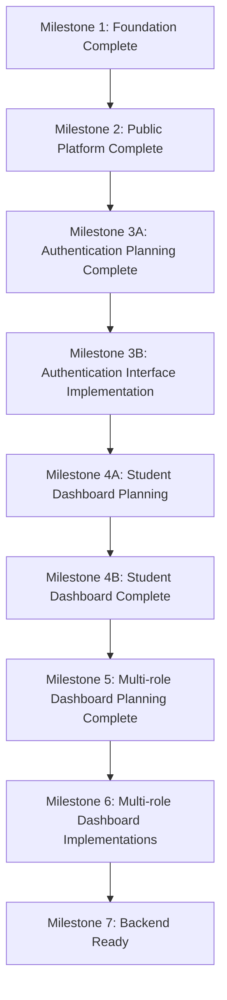

# Development Roadmap: Catalyst

This roadmap details the implementation timeline and quality gates structured around major milestones.

---

## Milestones & Implementation Phases

### Milestone 1: Foundation Complete
- **Phase 1: Project Foundation**
  - Next.js 15 App Router setup, TypeScript, and styling guidelines.

### Milestone 2: Public Platform Complete
- **Phase 2: Public Website**
  - Core marketing pages and validation-bound contact form.

### Milestone 3A: Authentication Planning Complete
- **Phase 3A: Identity Planning**
  - Session state slices and stepper validation rules.

### Milestone 3B: Authentication Interface Complete
- **Phase 3B: Authentication UI**
  - Login, registration, role selection, and onboarding steppers.

### Milestone 4A: Student Dashboard Planning Complete
- **Phase 4A: Student Dashboard Planning**
  - Define user journey maps and metrics models.

### Milestone 4B: Student Dashboard Complete
- **Phase 4B: Student Workspace UI**
  - Deploy Career commands overview, portfolio developers, job seekers, and mentor scheduler cards.

### Milestone 5: Multi-role Dashboard Planning Complete
- **Phase 5: Stakeholder Workspace Architecture**
  - Draft data structures, features modules, and shared directories maps for Mentor, Employer, and Admin portals.

### Milestone 6: Multi-role Dashboards Complete
- **Phase 5A: Mentor Workspace Implementation**
  - Deployed dynamic dashboard for advisors including student lists, portfolio reviews, career assessments, appointment sessions, availability, messages, and reports.
- **Phase 5B: Employer Portal Implementation**
  - Deployed employer workspace including talent discovery, opportunity management, candidate profiles, 7-stage Kanban screening, interviews, pipeline funnels, analytics, and messages.
- **Phase 5C: Admin / Coordinator Portal Implementation**
  - Deployed platform governance workspace including user management, mentor & employer verifications, opportunity approval moderation, partnerships, analytics, reports, notifications, and settings.
- **Phase 6: Cross-Portal Feature Parity & Gap Resolution**
  - Resolved all 9 audit gaps: Notification Inboxes across all portals, Admin Profile & Messages, Student Interviews & Employer Directory, Employer Reports, Mentor Analytics, and standardized grouped sidebars.

### Milestone 7: Backend Ready
- **Phase 7: Simulated Data Sync**
  - State wiring with local storage caches.
